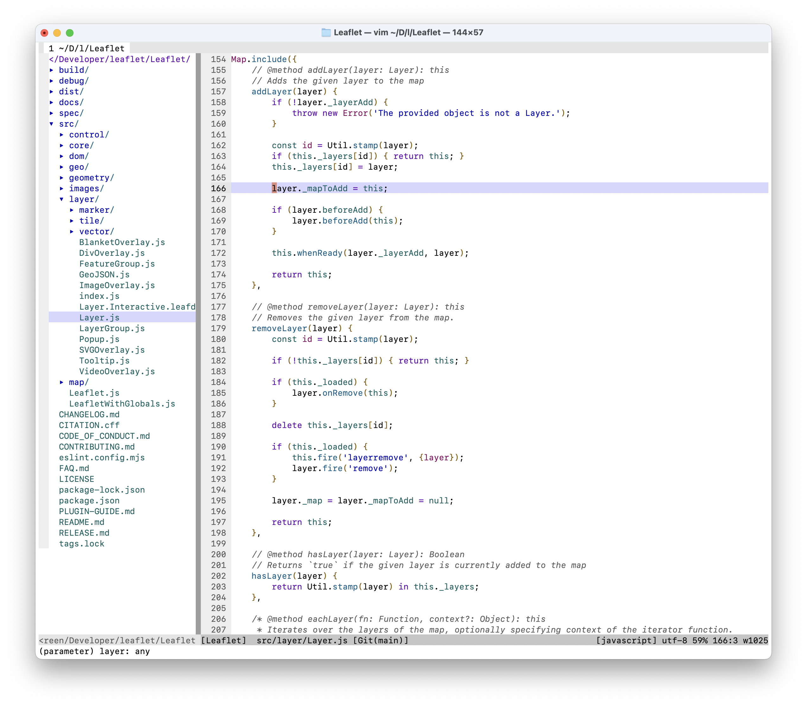
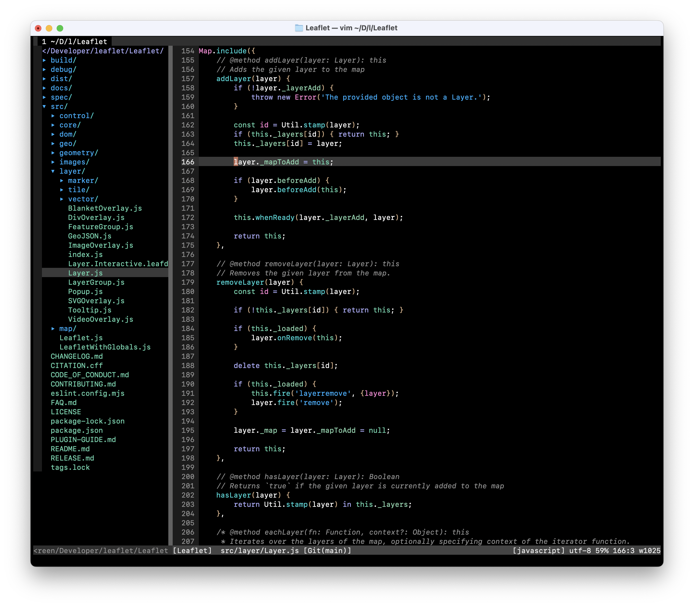

# 🎨 Modus colorscheme for Vim

A dark and light colorscheme for Vim based on the [original work for Emacs by Protesilaos Stavrou](https://protesilaos.com/emacs/modus-themes) and [NeoVim port by Miika Nissi](https://miikanissi.com/blog/modus-themes-for-neovim/). Generated via [vim-colortemplate by Lifepillar](https://github.com/lifepillar/vim-colortemplate).

## Modus Operandi



## Modus Vivendi



## Installation

Optionally use your favorite package manager like [vim-plug](https://github.com/junegunn/vim-plug).

```vim
Plug 'c9rgreen/vim-colors-modus'
```

## Extra

Extra themes for [macOS Terminal](https://support.apple.com/guide/terminal/welcome/mac) and [macOS color palettes](https://support.apple.com/guide/mac-help/use-colors-in-documents-on-mac-mchlp1190/mac) are included.

The typeface used in the screenshot is [San Francisco Mono](https://developer.apple.com/fonts/).
